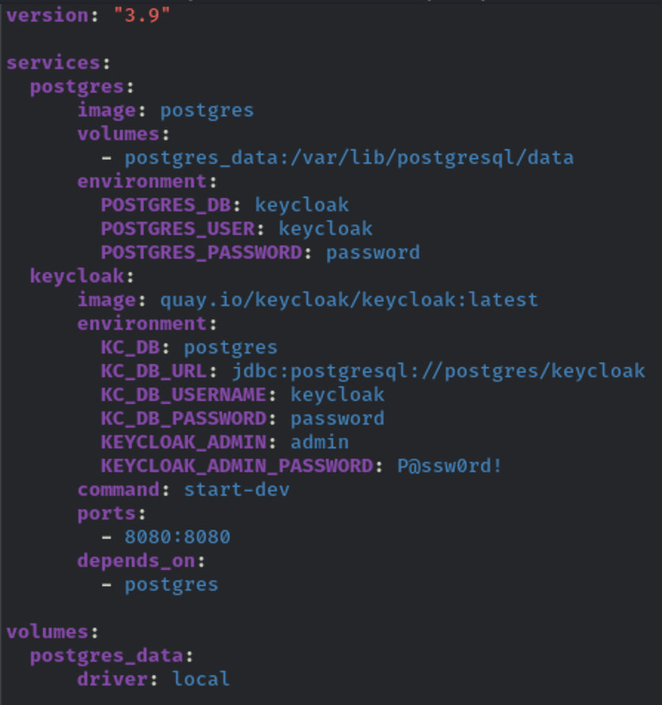

# Lab-1

## Развёртывание Keycloak с использованием Docker

## Стартовая страница Keycloak

## Панель входа в Keycloak

## Создание realm

## Создание пользователей `appadmin` и `user`

## Проверка наличия созданных пользователей

## Развёртывание приложения Nextcloud с использованием Docker

## Создание клиента в Keycloak

## Создание ролей `admin` и `user`

##               Cтартовая страница Nextcloud

## Установка Social Login

## Конфигурация Nextcloud для работы совместно с Keycloak

## Возможность аутентифицироваться в Nextcloud через Keycloak на странице входа

## Включение двухфакторной аутентификации в Keycloak

## Страница настройки 2FA при попытке аутентифицироваться

## Страница ввода одноразового кода при входе в аккаунт

